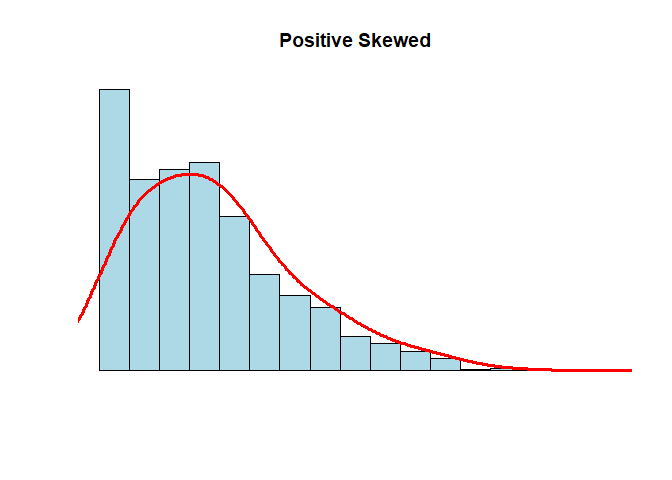

Atividade Avaliativa I
================
Rosenilda Pereira Barreto </br>
Introdução a Estatistica 2020.1

------------------------------------------------------------------------

**Questão 1**

**(a)** O erro de Astrobaldo é que ele considerou a mala mais pesada
sendo a que representa o valor do quartil superior e esqueceu de
analisar que pelo boxplot existem malas mais pesadas entre esse quartil
e o limite superior (29kg), onde está localizado 25% da amostra (malas).
Portanto, 23kg não representa a mala mais pesada da distribuição.

**(b)** A mediana é representada pelo segundo quartil, assim, o seu
valor é de 17kg

**(c)** A distância interquartílica é a diferença entre o quartil
superior pelo quartil inferior, assim, a distância seria 23 − 10 = 13.

**(d)** A quantidade de malas presente entre 5kg e 10kg está no primeiro
quartil que corresponde a 25% do total da amostra, assim, corresponderia
a 25% de 240 malas, ou seja, 60 malas.

**Questão 2** Obtive a soma de todas as médias dos 30 alunos,
multiplicando 30 pela média aritmética das notas, ou seja, 6.40
encontrando como resultado 192. Da mesma forma, obtive a soma total das
médias dos outros 50 alunos da outra turma, multiplicando o total de
alunos (50) por 5.20 tendo como total 260. Feito isso, somei a soma
total das médias das duas turma (192+260=452) e dividi por 80 (total de
alunos correspondente as duas turmas) (452/80). Assim, obtive que a
média aritmética dos 80 alunos é **(a)** 5.65

**Questão 3**

**(a)** Para criar o vetor, utilizei o seguinte código

``` r
X <- c(68, 70, 72, 58, 90, 110, 68, 70, 72, 80, 80, 67, 90, 94, 100, 80, 75, 79, 84, 90)
```

**(b)** Média = 79.85; </br> Primeiro quartil = 70.0; </br> Mediana =
79.5; </br> Terceiro quartil = 90; </br> Desvio padrão = 12.78681 </br>
Para encontrar essa resposta, utilizei os seguintes códigos

``` r
mean(X)

quantile(X)

median(X)

sd(X)
```

**(c)** No histograma, é possível perceber uma certa assimetria entre os
valores, por isso, acredito que a mediana representaria melhor como
medida central do conjunto de dados.

**Questão 4**

**(a)** Importei o dataset para o Rstudio com o seguinte código

``` r
frango_dieta <- read_csv("dados/brutos/frango_dieta.csv")
```

Ao analisar o dataset foi possível identificar que cada coluna
representava uma variável (peso, tempo, frango, dieta), cada linha
apresentava observações sobre as variáveis e cada célula apresentava uma
única observação, logo, este dataset está organizado na forma tidy

**(b)** Usando o código

``` r
mean(frango_dieta$peso)
```

Encontrei que a média do peso dos fragos é 121.8183

**(c)** Usando o código

``` r
sd(frango_dieta$peso)
```

Encontrei como desvio padrão o valor 71.07196

**(d)** A variável *peso* é quantitativa contínua.</br> A variável
*tempo* é quantitativa discreta </br> A variável *frango* é qualitativa
nominal </br> A variável *dieta* é qualitativa nominal

**Questão 5** Rodando o seguinte código

``` r
N <- 1000
x <- rnbinom(N, 4, .5)
hist(
x,
xlim = c(min(x), max(x)),
probability = T,
nclass = max(x) - min(x) + 1,
col = 'lightblue', xlab = ' ', ylab = ' ', axes = F,
main = 'Positive Skewed'
)
lines(density(x, bw = 1), col = 'red', lwd = 3)
```

<!-- -->

Analisando esse gráfico, é possível perceber que a disposição dos
valores é assimétrica, logo, a mediana é a melhor medida central para
representar esses dados.

**Questão 06**

**(a)** Importei o dataset com o código

``` r
dados_co2 <- read_csv("dados/brutos/dados_co2.csv")
```

**(b)** Não está no formato tidy, pois, as colunas não representam
variáveis, nesse caso, acredito que deveria haver 3 colunas (ano, mês,
co2)

**(c)** Organizei o conjunto de dados na forma tidy com o seguinte
código

``` r
dados_co2 %>%                
  pivot_longer(
    !ano,              
    names_to = "mes",    
    values_to = "ppm"  
  )
```

    ## # A tibble: 468 x 3
    ##      ano mes     ppm
    ##    <dbl> <chr> <dbl>
    ##  1  1959 jan    315.
    ##  2  1959 fev    316.
    ##  3  1959 mar    316.
    ##  4  1959 abr    318.
    ##  5  1959 mai    318.
    ##  6  1959 jun    318 
    ##  7  1959 jul    316.
    ##  8  1959 ago    315.
    ##  9  1959 set    314.
    ## 10  1959 out    313.
    ## # ... with 458 more rows

**(d)** Produzi e salvei o arquivo com o seguinte código

``` r
co2_tidy <- dados_co2 %>%
  pivot_longer(
    !ano,
    names_to = "mes",
    values_to = "ppm"
  )
write_csv(co2_tidy, "dados/tidy/co2_tidy.csv.")
```

**(e)** Salvei na variável co2\_tidy com o seguinte código

``` r
co2_tidy <- read_csv("dados/tidy/co2_tidy.csv") 
```

Executei o seguinte código

``` r
co2_tidy %>% 
  group_by(ano) %>% 
  summarise(media = round(mean(ppm), 2)) %>% 
  ggplot(aes(ano, media, group = 1)) + 
  geom_line(color = "blue", size = 1)
```

<!-- -->

Observando o gráfico, é possível perceber que a media da variável ppm
aumentou com o passar dos anos.

**Questão 7**

**(a)** Criei a tibble da seguinte forma:

``` r
tabela_tibble <- tribble(
  ~nome,       ~altura, ~peso,
  "Ana",       155,     50,
  "Ludmilla",  158,     61,
  "Cristina",  162,     65,
  "Tereza",    168,     68,
  "Patrícia",  170,     69,
  "Mariana",   170,     65,
  "Ana Paula", 172,     82,
  "Dirce",     173,     79
)
```

**(b)** A variável *nome* é uma variável qualitativa nominal </br> A
variável *altura* é uma variável quantitativa contínua </br> A variável
*peso* é uma variável quantitativa contínua

**(c)** Calculei a média, mediana e desvio padrão da altura e peso
usando os seguintes códigos

``` r
mean(tabela_tibble$peso)
median(tabela_tibble$peso)
sd(tabela_tibble$peso)

mean(tabela_tibble$altura)
median(tabela_tibble$altura)
sd(tabela_tibble$altura)
```

Para a altura encontrei </br> - média = 166 </br> - mediana = 169 </br>
- desvio padrão = 6.78233

Para o peso encontrei </br> - média = 67.375 </br> - mediana = 66.5
</br> - desvio padrão = 10.04188

**(d)** Executei o seguinte código

``` r
plot(tabela_tibble$peso, tabela_tibble$altura)
```

<!-- -->

Aparentemente, a relação observada é que, quanto maior o peso da pessoa,
maior é sua altura. Entretanto existe dois valores que distoam dessa
relação uma delas com o mesmo peso de 65kg porem maior do que a outra de
mesmo peso, e uma pesando acima de 80kg porém mais baixa do que a pessoa
que pesa proximo a 80kg
